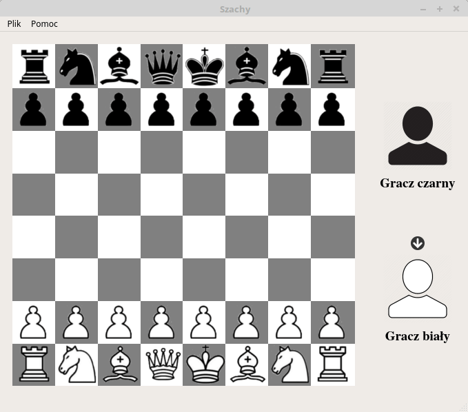

# Chess-In-QT
Prosta gra w szachy napisana za pomocą biblioteki Qt. 
Projekt zrealizowano w ramach laboratoriów Języków Programowania Obiektowego (Politechnika Poznańska).

Funkcje
===========================
* Wykorzystanie klas Qt Widgets do wyświetlania pionków i szachownicy
* Wyświetlanie współrzędnych oraz nazw figur na szachownicy 
* Zapis i odczyt przebiegu gry do/z plików tekstowych
* Wyświetlanie komunikatów o błędach w przypadku nieprawidłowych współrzędnych w zapisanym pliku
* Wyświetlanie aktualnej kolejki oraz listy straconych pionków na panelu bocznym
* USTAWIENIA: Możliwość zdefiniowania własnych kolorów / zestawów kolorów szachownicy
* Dołączona dokumentacja w formacie LaTeX oraz HTML wygenerowana za pomocą narzędzia Doxygen
* TODO: Obsługa języków

